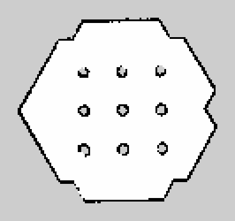
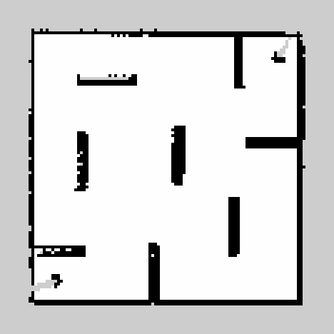
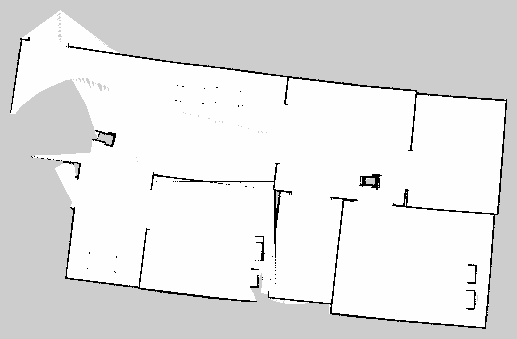
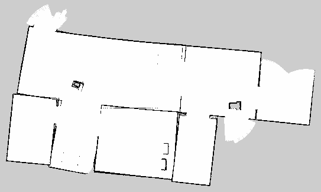

# ros2-indoor-slam

This is a modular and extensible ROS-based SLAM (Simultaneous Localization and Mapping) system designed to simulate robot navigation, environment mapping, and autonomous exploration.

A simulated TurtleBot3 explores an unknown indoor environment in Gazebo, builds a 2D occupancy-grid map with **GMapping** from its 360° LiDAR and odometry, and shows the map live in RViz. The project compares a **basic** explorer (plain obstacle avoidance) against **improved** explorers (spiral / wall-following / frontier-based paths with exit conditions and tuned navigation parameters) across environments of increasing difficulty.

> **Note on the name:** despite "ros2" in the repository name, this is a **ROS 1 (Noetic) catkin workspace**. It will not build with `colcon` / ROS 2.

The full write-up (in Vietnamese) is in [`ROS_fin.pdf`](ROS_fin.pdf).

---

## Contents

1. [Repository layout](#repository-layout)
2. [Requirements](#requirements)
3. [Setup](#setup)
4. [Running the simulation](#running-the-simulation)
5. [Results: 4 sample runs](#results-4-sample-runs)
6. [Runtime comparison](#runtime-comparison)
7. [Tuning parameters](#tuning-parameters)
8. [Troubleshooting](#troubleshooting)

---

## Repository layout

```
ros2-indoor-slam/
├── src/
│   ├── turtlebot3/               # TurtleBot3 description, SLAM, navigation, teleop (ROBOTIS)
│   ├── turtlebot3_msgs/          # TurtleBot3 message definitions (ROBOTIS)
│   ├── turtlebot3_simulations/   # Gazebo worlds + launch files, incl. our custom house/office worlds
│   ├── navigation/               # ROS navigation stack (move_base, amcl, costmap_2d, …)
│   ├── ros_autonomous_slam/      # Autonomous explorers: RRT frontier exploration, bug wall-follow
│   ├── maze_generator_ros/       # Maze world generator
│   ├── gzb_maze_gen/             # Gazebo maze generator
│   └── maps/                     # Saved maps used during development
├── Results/                      # Maps (.pgm/.yaml/.png) and screen recordings of each test
├── ROS_fin.pdf                   # Project report
├── build/ devel/ logs/           # catkin build output from the original machine (see Setup step 3)
└── .catkin_tools/                # catkin_tools profile
```

Custom additions on top of the upstream packages, in `src/turtlebot3_simulations/turtlebot3_gazebo/`:

| Launch file | World | Used in |
|---|---|---|
| `turtlebot3_myhouse.launch` | `Building_Gazebo_simulation_world-master_myhouse.world` | Test 3, Test 4 |
| `turtlebot3_smallhouse.launch` | `aws-robomaker-small-house-world-ros1_small_house.world` | extra |
| `turtlebot3_masterhouse.launch` | `robotics-build-my-world-master_housed_4_wheeled.world` | extra |
| `turtlebot3_myOffice.launch` | `RSE_Gazebo-master_myOffice.world` | extra |
| `turtlebot3_gochaseit.launch` | `Go_Chase_It_main_michelle.world` | extra |

---

## Requirements

| | Version used |
|---|---|
| OS | Ubuntu 20.04 |
| ROS | ROS 1 **Noetic** (desktop-full, includes Gazebo 11 and RViz) |
| Build tool | `catkin_tools` (`catkin build`) |
| Robot model | TurtleBot3 **burger** or **waffle** |

Install ROS Noetic by following the official guide: <http://wiki.ros.org/noetic/Installation/Ubuntu>

---

## Setup

### 1. Install the ROS packages the project depends on

```bash
sudo apt update
sudo apt install -y \
  python3-catkin-tools python3-rosdep \
  ros-noetic-joy ros-noetic-teleop-twist-joy ros-noetic-teleop-twist-keyboard \
  ros-noetic-laser-proc ros-noetic-rgbd-launch ros-noetic-depthimage-to-laserscan \
  ros-noetic-rosserial-arduino ros-noetic-rosserial-python \
  ros-noetic-rosserial-server ros-noetic-rosserial-client ros-noetic-rosserial-msgs \
  ros-noetic-amcl ros-noetic-map-server ros-noetic-move-base \
  ros-noetic-urdf ros-noetic-xacro ros-noetic-compressed-image-transport \
  ros-noetic-rqt ros-noetic-gmapping ros-noetic-navigation \
  ros-noetic-interactive-markers ros-noetic-base-local-planner ros-noetic-navfn \
  ros-noetic-gazebo-ros
```

### 2. Clone the workspace

```bash
cd ~
git clone https://github.com/nht-cyb/ros2-indoor-slam.git
cd ros2-indoor-slam
```

### 3. Clean the old build output, then build

The committed `build/` and `devel/` folders were generated on the original machine and contain absolute paths (`/home/ryuzuu/SlamProject/...`). Remove them before building, otherwise CMake will fail with "source directory does not match" errors.

```bash
source /opt/ros/noetic/setup.bash
catkin clean -y                      # deletes build/, devel/, logs/
rosdep install --from-paths src --ignore-src -r -y
catkin build
```

> Rebuild with `catkin build` every time you change a package in `src/`.

### 4. Set up your shell

Add these lines to the end of `~/.bashrc`, so every new terminal is ready to go:

```bash
source /opt/ros/noetic/setup.bash
source ~/ros2-indoor-slam/devel/setup.bash
export TURTLEBOT3_MODEL=burger        # or: waffle
export SVGA_VGPU10=0                  # only needed inside a VMware VM (fixes Gazebo rendering)
```

Then reload the shell:

```bash
source ~/.bashrc
```

---

## Running the simulation

Each step runs in its **own terminal**. Leave the earlier ones running.

### Terminal 1: start Gazebo with an environment

Pick one of the environments, from easiest to hardest:

```bash
# Test 1: easy, small symmetric hexagon world with 9 pillars
roslaunch turtlebot3_gazebo turtlebot3_world.launch

# Test 2: medium, enclosed maze with narrow passages
roslaunch turtlebot3_gazebo turtlebot3_stage_4.launch

# Test 3 / 4: hard, large multi-room house
roslaunch turtlebot3_gazebo turtlebot3_myhouse.launch
```

### Terminal 2: start GMapping SLAM (opens RViz)

```bash
roslaunch turtlebot3_slam turtlebot3_slam.launch slam_methods:=gmapping
```

RViz shows the occupancy grid. It only covers what the LiDAR can see from the start pose until the robot moves.

### Terminal 3: make the robot explore

Choose **one** explorer:

**a) Basic explorer:** drives forward and turns away from obstacles. There is no stop condition, so you stop it with `Ctrl+C` once the map looks complete.

```bash
roslaunch turtlebot3_gazebo turtlebot3_simulation.launch
```

**b) Improved explorer:** uses `move_base` with frontier detection, so the robot keeps heading for unexplored areas instead of circling known ones.

```bash
# RRT frontier exploration (default)
roslaunch ros_autonomous_slam autonomous_explorer.launch

# or bug / wall-following exploration
roslaunch ros_autonomous_slam autonomous_explorer.launch explorer:=BUG_WALLFOLLOW
```

> `autonomous_explorer.launch` starts its own GMapping + RViz, so with option **b** you can skip Terminal 2.
>
> For **RRT**, use RViz's **Publish Point** tool to click 5 points in this order: the 4 corners of the region to explore, then 1 point inside the known area. Exploration starts after the 5th click. See the [rrt_exploration tutorial](http://wiki.ros.org/rrt_exploration/Tutorials/singleRobot).

**c) Manual driving (optional):** if the robot gets stuck, you can steer it yourself with the keyboard:

```bash
roslaunch turtlebot3_teleop turtlebot3_teleop_key.launch
```

### Terminal 4: save the map

When the map looks complete:

```bash
rosrun map_server map_saver -f ~/map
```

This writes `~/map.pgm` (the image) and `~/map.yaml` (resolution and origin). To use the map for navigation later:

```bash
roslaunch turtlebot3_navigation turtlebot3_navigation.launch map_file:=$HOME/map.yaml
```

### Useful inspection commands

```bash
rosnode list                 # running nodes
rostopic list                # active topics
rostopic echo /cmd_vel       # live velocity commands sent to the robot
rosrun rqt_graph rqt_graph   # node/topic graph
```

---

## Results: 4 sample runs

All maps were saved with `map_saver` at **0.05 m/pixel**. The previews below are cropped to the mapped area: white = free, black = obstacle/wall, grey = unknown. Raw `.pgm` / `.yaml` files and screen recordings are in [`Results/`](Results/).

### Sample 1: Hexagon world (easy)



- **World:** `turtlebot3_world.launch`, small and symmetric, 9 cylindrical pillars, wide gaps.
- **Basic run:** the map was accurate, but the robot kept revisiting known areas and never stopped by itself, so it had to be stopped and saved by hand.
  [Recording](Results/Test1_TB3_HexaWorld/simple-slam-basic-build-package1.mkv)
- **Improved run:** a spiral path from the centre outward with obstacle avoidance, which stops after 4 laps. It built the same complete map in much less time.
  [Recording](Results/Test1_TB3_HexaWorld/slightly_more_advanced_path.mkv)
- **Mapped free area:** 19.9 m².

### Sample 2: Maze (medium)



- **World:** `turtlebot3_stage_4.launch`, enclosed square maze with narrow corridors.
- **What happened:** the robot spent a long time measuring at each wall. With the default `inflation_radius` it refused to enter corridors that were wide enough for it, which left gaps in early maps. The report's fix was to lower the inflation radius and add wall-following so the robot could get into the narrow passages. The saved map shows the full maze outline.
  [Recording](Results/Test2_TB3_maze/simplescreenrecorder-stage4-simple-slam.mkv)
- **Mapped free area:** 19.6 m².

### Sample 3: House, attempt 2 (hard)



- **World:** `turtlebot3_myhouse.launch`, a large multi-room house with many partitions and small details.
- **What happened:** the robot reached most rooms, but over the long run odometry drift bent the map: the top wall is slanted and the left-hand rooms are only partly mapped. Attempt 1 ended early after the robot hit a small obstacle and couldn't continue.
  [Attempt 1](Results/Test3_TB3_myhouse/a-failed-attempt-1.mkv) · [Attempt 2](Results/Test3_TB3_myhouse/slightly-less-failed-attempt-2.mkv)
- **Mapped free area:** 244.9 m².

### Sample 4: House, optimised run (hard)



- **World:** same house as Sample 3.
- **What changed:** per-room loop counters with an exit condition, frontier-based goal selection (go to the nearest reachable unexplored point), a stop condition on collisions or timeouts, higher velocity limits, a longer LiDAR range, and partial maps merged with `merge_maps`.
- **Result:** the walls are straight, the left-hand rooms are closed off, and the room layout is clean. Compared with Sample 3, it mapped a slightly smaller total area (237.6 m² vs 244.9 m²) because it doesn't spill outside the house.

---

## Runtime comparison

Runtimes are the **lengths of the screen recordings** in `Results/`, i.e. wall-clock time from launch until mapping stopped. They are single runs on one machine, not repeated benchmarks.

| Sample | Environment | Explorer | Runtime | Mapped free area | Outcome |
|---|---|---|---|---|---|
| 1 | Hexagon (easy) | Basic: obstacle avoidance | **4 min 02 s** | 19.9 m² | Complete map, manual stop |
| 1 | Hexagon (easy) | Improved: spiral + lap limit | **2 min 17 s** | 19.9 m² | Complete map, **43 % faster**, stops itself |
| 2 | Maze (medium) | Basic: obstacle avoidance | **5 min 39 s** | 19.6 m² | Complete outline, slow near walls |
| 3 | House (hard) | Attempt 1 | **15 min 52 s** | n/a (no map saved) | Stopped after a collision |
| 3 | House (hard) | Attempt 2 | **33 min 30 s** | 244.9 m² | Most rooms reached, visible drift |
| 4 | House (hard) | Optimised + merged maps | n/a (no recording) | 237.6 m² | Clean, complete room layout |

**Takeaways**

- **Easy world:** giving the robot a structured path and a stop condition cut mapping time by 43 % with no loss in map quality.
- **Difficulty drives runtime:** the house took roughly 8× longer than the hexagon world for about 12× the area.
- **Large worlds:** a single long run isn't enough, because drift builds up over 30+ minutes. Shorter runs with exit conditions, merged afterwards, gave the best map.

---

## Tuning parameters

| What | File | Effect |
|---|---|---|
| `inflation_radius` | `src/turtlebot3/turtlebot3_navigation/param/costmap_common_params_<model>.yaml` | How far the robot keeps from obstacles. Lower it (it must still be larger than the robot's radius) to fit through narrow corridors. Default here: `1.0`. |
| `max_vel_x`, `max_vel_theta`, … | `src/turtlebot3/turtlebot3_navigation/param/dwa_local_planner_params_<model>.yaml` | Faster linear/angular speeds explore large maps in less time. |
| LiDAR range (`<max>`) | `src/turtlebot3/turtlebot3_description/urdf/turtlebot3_<model>.gazebo.xacro` | A longer range sees more per scan, so less driving is needed. |
| RRT `eta` / `Geta` | `src/ros_autonomous_slam/launch/RRT.launch` | Local / global RRT growth step sizes. |

Run `catkin build` again after editing anything under `src/`.

---

## Troubleshooting

| Symptom | Fix |
|---|---|
| `CMake Error: The source directory ... does not match the source used to generate cache` | Run `catkin clean -y`, then `catkin build` (see Setup step 3). |
| `Invalid <arg> tag: environment variable 'TURTLEBOT3_MODEL' is not set` | `export TURTLEBOT3_MODEL=burger` in that terminal, or add it to `~/.bashrc`. |
| `Resource not found: turtlebot3_gazebo` | You haven't sourced the workspace: `source ~/ros2-indoor-slam/devel/setup.bash`. |
| Gazebo shows a black screen or crashes in a VM | `export SVGA_VGPU10=0` before launching. |
| Robot circles the same area forever | Expected with the basic explorer. Switch to `autonomous_explorer.launch`, or steer manually with teleop. |
| Robot won't enter narrow corridors | Lower `inflation_radius` (see Tuning parameters). |

---

## Credits

- TurtleBot3 packages: [ROBOTIS-GIT](https://github.com/ROBOTIS-GIT)
- Navigation stack: [ros-planning/navigation](https://github.com/ros-planning/navigation)
- Autonomous exploration: [fazildgr8/ros_autonomous_slam](https://github.com/fazildgr8/ros_autonomous_slam)
- Maze generators: [Smadas/maze_generator_ros](https://github.com/Smadas/maze_generator_ros), [minutiaes/gzb_maze_gen](https://github.com/minutiaes/gzb_maze_gen)

Project by Nguyễn Huyền Trang and Lê Phấn Nam. Supervisors: Assoc. Prof. Hoàng Văn Xiêm and Eng. Nguyễn Cảnh Thanh. VNU University of Engineering and Technology, 2023.
